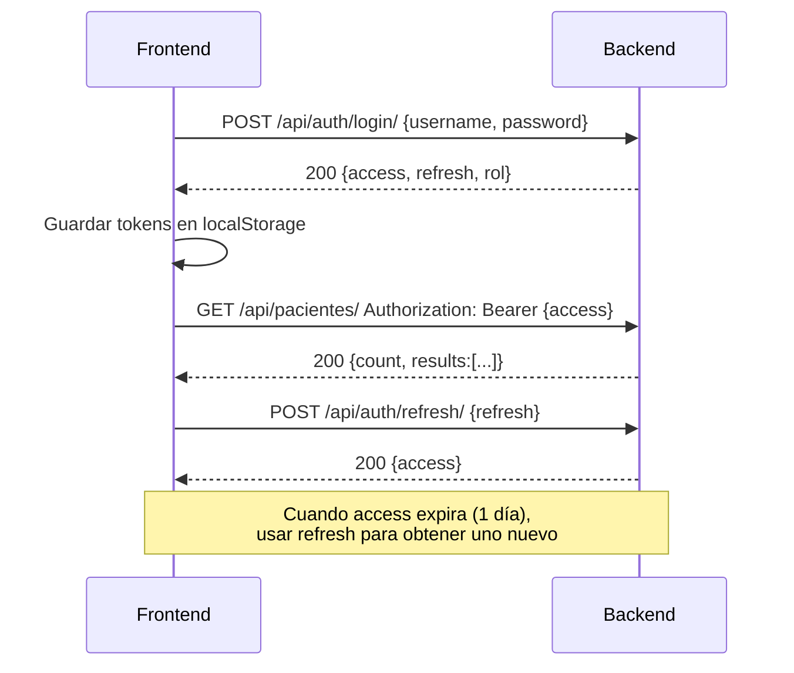

# Documentación de Endpoints - HealthAnalytics IPS

> **Nota:** El parámetro `format` del endpoint de exportación se renombró a `export_format` para evitar conflicto con palabras reservadas internas de Django.

---

## Módulo: Autenticación

### `POST /api/auth/login/`
- **Propósito:** Obtener tokens JWT (access + refresh) y usuario autenticado.
- **Roles permitidos:** Público (no requiere auth).
- **Headers:**
  - `Content-Type: application/json`
- **Body JSON (entrada):**
  ```json
  {
    "username": "admin_test",
    "password": "adminpassword123"
  }
  ```
- **Respuesta 200 (éxito):**
  ```json
  {
    "refresh": "eyJhbGciOiJIUzI1NiIsInR5cCI6IkpXVCJ9...",
    "access": "eyJhbGciOiJIUzI1NiIsInR5cCI6IkpXVCJ9...",
    "rol": "Administrador"
  }
  ```
- **Respuesta 401 (credenciales inválidas):**
  ```json
  {
    "detail": "No active account found with the given credentials"
  }
  ```

### `POST /api/auth/refresh/`
- **Propósito:** Renovar token de acceso usando el refresh token.
- **Roles permitidos:** Público.
- **Headers:**
  - `Content-Type: application/json`
- **Body JSON (entrada):**
  ```json
  {
    "refresh": "eyJhbGciOiJIUzI1NiIsInR5cCI6IkpXVCJ9..."
  }
  ```
- **Respuesta 200:**
  ```json
  {
    "access": "eyJhbGciOiJIUzI1NiIsInR5cCI6IkpXVCJ9..."
  }
  ```
- **Respuesta 401 (refresh token inválido/expirado):**
  ```json
  {
    "detail": "Token is invalid or expired",
    "code": "token_not_valid"
  }
  ```

---

## Módulo: Pacientes

### `GET /api/pacientes/`
- **Propósito:** Obtener listado paginado de pacientes.
- **Roles permitidos:** `Administrador`, `Médico`.
- **Headers:**
  - `Authorization: Bearer {access_token}`
- **Query params opcionales:**
  - `search`: búsqueda por nombre o apellido (case-insensitive).
  - `riesgo`: filtrar por nivel de riesgo (`Bajo`, `Medio`, `Alto`, `Crítico`).
  - `page`: número de página (por defecto 1).
  - `page_size`: registros por página (por defecto 10).
- **Respuesta 200 (JSON paginado):**
  ```json
  {
    "count": 1801,
    "next": "http://127.0.0.1:8000/api/pacientes/?page=2",
    "previous": null,
    "results": [
      {
        "id": 1,
        "nombres": "María",
        "apellidos": "González",
        "edad": 45,
        "sexo": "F",
        "peso": "65.50",
        "altura": "1.62",
        "imc": 24.91,
        "presion_sistolica": 120,
        "presion_diastolica": 80,
        "frecuencia_cardiaca": 72,
        "saturacion_oxigeno": "98.00",
        "temperatura": "36.50",
        "glucosa": 95.00,
        "colesterol": 180.00,
        "antecedentes_familiares": true,
        "fumador": false,
        "consumo_alcohol": false,
        "actividad_fisica": "Media",
        "diagnostico_preliminar": "Paciente sano",
        "riesgo_enfermedad": "Bajo",
        "fecha_consulta": "2025-04-10",
        "critico": false
      }
    ]
  }
  ```
- **Respuesta 401 (sin token):**
  ```json
  {
    "detail": "Authentication credentials were not provided."
  }
  ```
- **Respuesta 403 (rol sin permisos):**
  ```json
  {
    "detail": "You do not have permission to perform this action."
  }
  ```

### `GET /api/pacientes/{id}/`
- **Propósito:** Obtener detalle de un paciente por ID.
- **Roles permitidos:** `Administrador`, `Médico`.
- **Headers:**
  - `Authorization: Bearer {access_token}`
- **Path params:**
  - `id`: entero, identificador único del paciente.
- **Respuesta 200:**
  ```json
  {
    "id": 1,
    "nombres": "María",
    "apellidos": "González",
    "edad": 45,
    "sexo": "F",
    "peso": "65.50",
    "altura": "1.62",
    "imc": 24.91,
    "presion_sistolica": 120,
    "presion_diastolica": 80,
    "frecuencia_cardiaca": 72,
    "saturacion_oxigeno": "98.00",
    "temperatura": "36.50",
    "glucosa": 95.00,
    "colesterol": 180.00,
    "antecedentes_familiares": true,
    "fumador": false,
    "consumo_alcohol": false,
    "actividad_fisica": "Media",
    "diagnostico_preliminar": "Paciente sano",
    "riesgo_enfermedad": "Bajo",
    "fecha_consulta": "2025-04-10",
    "critico": false
  }
  ```
- **Respuesta 404:**
  ```json
  {
    "detail": "Not found."
  }
  ```

### `POST /api/pacientes/upload/`
- **Propósito:** Cargar archivo CSV/XLSX con datos de pacientes para procesamiento ETL.
- **Roles permitidos:** `Administrador`, `Analista`.
- **Headers:**
  - `Authorization: Bearer {access_token}`
  - `Content-Type: multipart/form-data`
- **Body (form-data):**
  - Campo `archivo`: archivo `.csv`, `.xlsx` o `.xls`.
- **Respuesta 201/200 (éxito):**
  ```json
  {
    "mensaje": "Archivo cargado correctamente",
    "registros_procesados": 150,
    "archivo": "dataset_clinico_etl_150_registros.xlsx"
  }
  ```
- **Respuesta 400 (formato inválido):**
  ```json
  {
    "archivo": ["Formato de archivo no soportado. Debe ser .csv, .xlsx o .xls"]
  }
  ```

### `POST /api/etl/run/`
- **Propósito:** Ejecutar el proceso ETL (Extracción, Transformación, Carga).
- **Roles permitidos:** `Administrador`, `Analista`.
- **Headers:**
  - `Authorization: Bearer {access_token}`
  - `Content-Type: application/json`
- **Body JSON:**
  ```json
  {
    "archivo": "dataset_clinico_etl_1800_registros.xlsx"
  }
  ```
- **Respuesta 200 (éxito):**
  ```json
  {
    "estado": "EXITOSO",
    "mensaje": "Proceso ETL completado",
    "registros_procesados": 1800,
    "tiempo_ejecucion": "00:00:45",
    "archivo_generado": "dataset_clinico_etl_1800_registros.xlsx"
  }
  ```
- **Respuesta 400 (archivo no encontrado):**
  ```json
  {
    "detalle": "Archivo no encontrado en el sistema"
  }
  ```

### `GET /api/etl/history/`
- **Propósito:** Obtener historial de ejecuciones ETL.
- **Roles permitidos:** `Administrador`, `Analista`.
- **Headers:**
  - `Authorization: Bearer {access_token}`
- **Query params opcionales:**
  - `page`: número de página.
- **Respuesta 200:**
  ```json
  {
    "count": 16,
    "next": null,
    "previous": null,
    "results": [
      {
        "id": 1,
        "fecha_ejecucion": "2025-05-20T10:30:00Z",
        "usuario": "admin_test",
        "archivo": "dataset_clinico_etl_1800_registros.xlsx",
        "registros_procesados": 1800,
        "tiempo_ejecucion": "00:00:45",
        "estado": "exitosa"
      }
    ]
  }
  ```

---

## Módulo: Reportes (Exportación)

### `GET /api/reportes/export/?export_format={formato}`
- **Propósito:** Exportar datos de pacientes en CSV, Excel o PDF con diseño landscape.
- **Roles permitidos:** `Administrador`, `Médico`, `Analista`.
- **Método HTTP:** `GET`
- **Headers:**
  - `Authorization: Bearer {access_token}`
- **Query params obligatorios:**
  - `export_format`: `csv`, `excel` o `pdf`
- **Query params opcionales:**
  - `search`: búsqueda por nombre o apellido.
  - `riesgo`: filtrar por nivel de riesgo.
  - `fecha_desde`: fecha inicial (`YYYY-MM-DD`).
  - `fecha_hasta`: fecha final (`YYYY-MM-DD`).
- **Validación:** `fecha_desde` no puede ser posterior a `fecha_hasta`.
- **Respuesta 200 (éxito) — Content-Type varía según formato:**
  - **CSV:** `text/csv; charset=utf-8`
    - **Body:**
      ```csv
      ID;Nombres;Apellidos;Ed;Sx;W(kg);H(m);IMC;PAS;PAD;FC;Sat%;T(°C);Glu;Col;Antc;Fum;Alc;Act.Física;Diagnóstico Preliminar;Riesgo;Fecha;Crít
      1;"María";"González";45;"F";65.50;1.62;24.91;120;80;72;98.00;36.50;95.00;180.00;NO;NO;NO;"Media";"Paciente sano";"Bajo";"2025-04-10";"NO"
      ```
  - **Excel:** `application/vnd.openxmlformats-officedocument.spreadsheetml.sheet`
    - **Body:** binario ZIP/XLSX (magic bytes `PK`).
    - **Content-Disposition:** `attachment; filename="pacientes.xlsx"`
  - **PDF:** `application/pdf`
    - **Body:** binario PDF (magic bytes `%PDF-`).
    - **Content-Disposition:** `attachment; filename="pacientes.pdf"`
    - **Características:** orientación landscape, tabla con 23 columnas, fuente compacta.
- **Respuesta 400 (parámetro faltante o inválido):**
  ```json
  {
    "export_format": ["Este campo es requerido."]
  }
  ```
  ```json
  {
    "export_format": ["Valor inválido. Opciones: csv, excel, pdf."]
  }
  ```
  ```json
  {
    "non_field_errors": ["La fecha 'fecha_desde' no puede ser posterior a 'fecha_hasta'."]
  }
  ```
- **Respuesta 401 (sin token):**
  ```json
  {
    "detail": "Authentication credentials were not provided."
  }
  ```
- **Respuesta 403 (rol sin permisos):**
  ```json
  {
    "detail": "You do not have permission to perform this action."
  }
  ```

---

## Módulo: Analytics

### `GET /api/dashboard/kpis/`
- **Propósito:** Obtener KPIs globales y estadísticas descriptivas.
- **Roles permitidos:** `Administrador`, `Médico`, `Analista`.
- **Headers:**
  - `Authorization: Bearer {access_token}`
- **Query params:** Ninguno.
- **Respuesta 200:**
  ```json
  {
    "estado": "EXITOSO",
    "datos": {
      "kpis_globales": {
        "total_registros": 1801,
        "pacientes_criticos": 329,
        "pacientes_hipertensos": 715,
        "pacientes_diabeticos": 805,
        "pacientes_fumadores": 1093,
        "riesgo_promedio_poblacional": "Medio",
        "distribucion_riesgo": {
          "Bajo": 680,
          "Medio": 316,
          "Alto": 207,
          "Crítico": 598
        }
      },
      "estadistica_descriptiva": {
        "edad": {
          "media": 54.68,
          "mediana": 55.0,
          "moda": 78.0,
          "desviacion_estandar": 20.9
        },
        "presion_sistolica": {
          "media": 136.58,
          "mediana": 123.0,
          "moda": 117.0,
          "desviacion_estandar": 24.79
        },
        "glucosa": {
          "media": 143.75,
          "mediana": 100.54,
          "moda": 84.08,
          "desviacion_estandar": 77.29
        },
        "saturacion_oxigeno": {
          "media": 92.98,
          "mediana": 95.85,
          "moda": 97.25,
          "desviacion_estandar": 6.45
        }
      },
      "segmentaciones": {
        "por_sexo": {
          "M": 905,
          "F": 896
        },
        "por_edad": {
          "0-17": 28,
          "18-34": 401,
          "35-49": 368,
          "50-64": 357,
          "65+": 647
        }
      }
    }
  }
  ```
- **Respuesta 500 (error interno):**
  ```json
  {
    "estado": "ERROR",
    "detalle": "Descripción del error"
  }
  ```

---

## Módulo: ML

### `POST /api/ml/prediccion/`
- **Propósito:** Predecir riesgo de enfermedad para nuevos datos clínicos.
- **Roles permitidos:** `Administrador`, `Médico`.
- **Headers:**
  - `Authorization: Bearer {access_token}`
  - `Content-Type: application/json`
- **Body JSON (entrada completa, con validaciones):**
  ```json
  {
    "edad": 55,
    "sexo": "M",
    "peso": 78.5,
    "altura": 1.75,
    "presion_sistolica": 140,
    "presion_diastolica": 90,
    "frecuencia_cardiaca": 78,
    "saturacion_oxigeno": 96.5,
    "temperatura": 36.8,
    "glucosa": 110.0,
    "colesterol": 210.0,
    "antecedentes_familiares": true,
    "actividad_fisica": "Media",
    "fumador": false,
    "consumo_alcohol": false
  }
  ```
  **Validaciones por campo:**
  | Campo | Tipo | Rango / Opciones |
  |-------|------|------------------|
  | `edad` | Integer | 0 - 120 |
  | `sexo` | Choice | `M`, `F` |
  | `peso` | Float | 1.0 - 500.0 kg |
  | `altura` | Float | 0.3 - 2.5 m |
  | `presion_sistolica` | Integer | 40 - 300 mmHg |
  | `presion_diastolica` | Integer | 30 - 200 mmHg |
  | `frecuencia_cardiaca` | Integer | 20 - 250 lpm |
  | `saturacion_oxigeno` | Float | 10.0 - 100.0 % |
  | `temperatura` | Float | 15.0 - 45.0 °C |
  | `glucosa` | Float | 20.0 - 600.0 mg/dL |
  | `colesterol` | Float | 50.0 - 500.0 mg/dL |
  | `antecedentes_familiares` | Boolean | `true` / `false` |
  | `actividad_fisica` | String | Máx 50 caracteres (ej: `Sedentario`, `Baja`, `Media`, `Alta`) |
  | `fumador` | Boolean | `true` / `false` |
  | `consumo_alcohol` | Boolean | `true` / `false` |
- **Respuesta 200 (éxito):**
  ```json
  {
    "estado": "EXITOSO",
    "riesgo_predicho": "Medio"
  }
  ```
  **Valores posibles para `riesgo_predicho`:** `Bajo`, `Medio`, `Alto`, `Crítico`.
- **Respuesta 400 (datos inválidos):**
  ```json
  {
    "edad": ["Asegúrese de que este valor sea mayor o igual a 0."],
    "sexo": ["\"X\" no es una elección válida."],
    "peso": ["El peso debe estar entre 1.0 y 500.0."]
  }
  ```
- **Respuesta 401 (sin token):**
  ```json
  {
    "detail": "Authentication credentials were not provided."
  }
  ```
- **Respuesta 403 (rol sin permisos — Analista):**
  ```json
  {
    "detail": "You do not have permission to perform this action."
  }
  ```
- **Respuesta 500 (error en inferencia del modelo):**
  ```json
  {
    "error": "Descripción del error interno del modelo ML"
  }
  ```

---

## Mapa de Rutas

| Ruta | Método | Vista | Roles permitidos |
|------|--------|-------|-------------------|
| `/api/auth/login/` | POST | `TokenObtainPairView` | Público |
| `/api/auth/refresh/` | POST | `TokenRefreshView` | Público |
| `/api/pacientes/` | GET | `PacienteListAPIView` | Admin, Médico |
| `/api/pacientes/{id}/` | GET | `PacienteDetailAPIView` | Admin, Médico |
| `/api/pacientes/upload/` | POST | `PacientesUploadView` | Admin, Analista |
| `/api/etl/run/` | POST | `ETLRunView` | Admin, Analista |
| `/api/etl/history/` | GET | `ETLHistoryView` | Admin, Analista |
| `/api/reportes/export/` | GET | `ReportesExportAPIView` | Admin, Médico, Analista |
| `/api/dashboard/kpis/` | GET | `DashboardKPIsAPIView` | Admin, Médico, Analista |
| `/api/ml/prediccion/` | POST | `PrediccionRiesgoAPIView` | Admin, Médico |

---

## Códigos de Error Comunes

| Código | Significado | Ejemplo de Body |
|--------|-------------|-----------------|
| `400 Bad Request` | Parámetros faltantes o inválidos | `{"export_format": ["Este campo es requerido."]}` |
| `401 Unauthorized` | Token ausente, inválido o expirado | `{"detail": "Authentication credentials were not provided."}` |
| `403 Forbidden` | Rol insuficiente para el endpoint | `{"detail": "You do not have permission to perform this action."}` |
| `404 Not Found` | Ruta no existe o recurso no encontrado | `{"detail": "Not found."}` |
| `500 Internal Server Error` | Error en servicio (ETL, ML, generación PDF) | `{"error": "Descripción del error"}` |

---

## Flujo de Autenticación Completo



---

## Guía de Implementación Frontend (Actualizada)

### 1. Almacenamiento del Token
Tras login exitoso, guardar `access` y `refresh` token en `localStorage` o `sessionStorage`:

```javascript
const { access, refresh, rol } = await response.json();
localStorage.setItem('access_token', access);
localStorage.setItem('refresh_token', refresh);
localStorage.setItem('user_rol', rol);
```

### 2. Interceptor de Token Expirado
Capturar 401 y refrescar automáticamente:

```javascript
async function fetchWithAuth(url, options = {}) {
  let token = localStorage.getItem('access_token');
  const refresh = localStorage.getItem('refresh_token');

  const headers = {
    'Authorization': `Bearer ${token}`,
    ...options.headers
  };

  let res = await fetch(url, { ...options, headers });

  if (res.status === 401 && refresh) {
    // Intentar refrescar
    const refreshRes = await fetch('/api/auth/refresh/', {
      method: 'POST',
      headers: { 'Content-Type': 'application/json' },
      body: JSON.stringify({ refresh })
    });

    if (refreshRes.ok) {
      const { access } = await refreshRes.json();
      localStorage.setItem('access_token', access);
      headers['Authorization'] = `Bearer ${access}`;
      return fetch(url, { ...options, headers });
    } else {
      // Refresh falló, redirigir a login
      localStorage.clear();
      window.location.href = '/';
    }
  }

  return res;
}
```

### 3. Headers de Autenticación
Incluir en toda petición autenticada:

```javascript
headers: {
  'Authorization': `Bearer ${localStorage.getItem('access_token')}`
}
```

### 4. Exportación de Reportes
**Endpoint:** `GET /api/reportes/export/?export_format={formato}`

```javascript
const exportarPacientes = async (formato, filtros = {}) => {
  const params = new URLSearchParams({ export_format: formato, ...filtros });
  const response = await fetchWithAuth(`/api/reportes/export/?${params}`, {
    method: 'GET'
  });

  if (!response.ok) {
    const err = await response.json().catch(() => ({}));
    throw new Error(err.detail || err.export_format?.[0] || `Error ${response.status}`);
  }

  const blob = await response.blob();
  const ext = { pdf: 'pdf', excel: 'xlsx', csv: 'csv' }[formato];
  const url = window.URL.createObjectURL(blob);
  const a = document.createElement('a');
  a.href = url;
  a.download = `pacientes.${ext}`;
  a.click();
  window.URL.revokeObjectURL(url);
};

// Uso:
exportarPacientes('pdf');
exportarPacientes('excel', { riesgo: 'Alto', fecha_desde: '2024-01-01' });
```

### 5. Predicción ML

```javascript
const predecirRiesgo = async (datosPaciente) => {
  const response = await fetchWithAuth('/api/ml/prediccion/', {
    method: 'POST',
    headers: { 'Content-Type': 'application/json' },
    body: JSON.stringify(datosPaciente)
  });

  if (!response.ok) {
    const err = await response.json();
    throw new Error(JSON.stringify(err));
  }

  return await response.json();
  // { "estado": "EXITOSO", "riesgo_predicho": "Medio" }
};

// Ejemplo de uso:
const resultado = await predecirRiesgo({
  edad: 55,
  sexo: "M",
  peso: 78.5,
  altura: 1.75,
  presion_sistolica: 140,
  presion_diastolica: 90,
  frecuencia_cardiaca: 78,
  saturacion_oxigeno: 96.5,
  temperatura: 36.8,
  glucosa: 110.0,
  colesterol: 210.0,
  antecedentes_familiares: true,
  actividad_fisica: "Media",
  fumador: false,
  consumo_alcohol: false
});
console.log(resultado.riesgo_predicho); // "Medio"
```

### 6. Consideraciones

- **PDF Landscape:** El archivo PDF se genera en orientación horizontal (landscape) con tabla compacta de 23 columnas.
- **Streaming CSV:** Se envía fila por fila sin saturar RAM (ideal para >10k registros).
- **Filtros aplicables en exportación:** `search`, `riesgo`, `fecha_desde`, `fecha_hasta`.
- **Validación de fechas:** Si `fecha_desde > fecha_hasta`, el backend retorna `400`.
- **Roles en UI:** Ocultar/mostrar opciones según el rol autenticado.
- **Refresh Token:** Rotar cada 7 días; access caduca cada 1 día.
- **CORS:** Backend configurado con `CORS_ALLOW_ALL_ORIGINS = True` para desarrollo frontend standalone.
